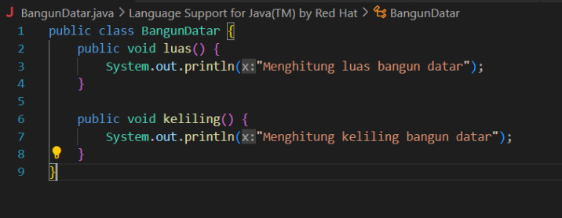
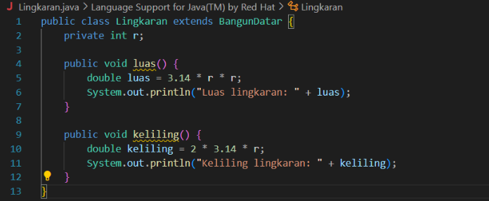
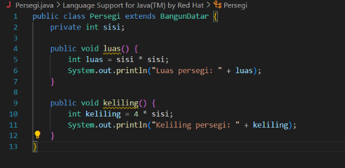
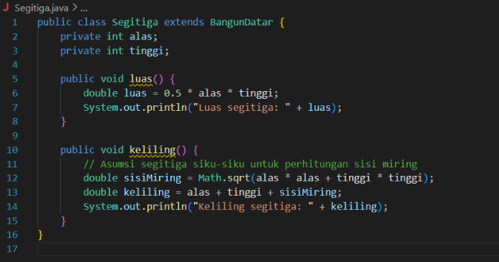
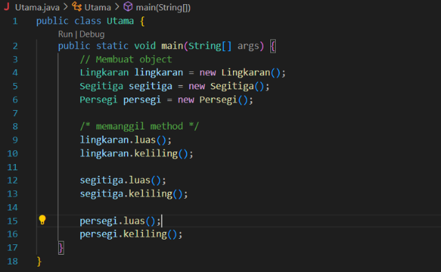
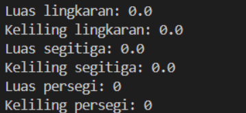

# polimorfisme

<h4>bangun datar adalh induk class yang kemudian mewarisi method itu sendiri kepada class persegi, segitiga dan lingkaran contoh method yg diwarisi ialah   </h4>  <h2> luas() & keliling()</h2>

<h2>BangunDatar</h2>

<h2>lingkaran</h2>

<h2>persegi</h2>

<h2>segitiga</h2>

<h2>utama</h2>

<h2>output</h2>

